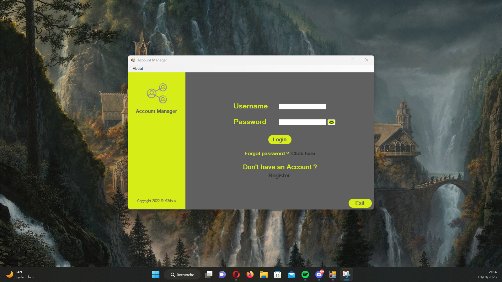

# Account Manager - One Place for All Your Passwords

Account Manager is a desktop app that helps you keep all your login credentials for different platforms in one place. It saves you from the trouble of remembering multiple passwords and struggling with the "Forgot Password" option every time you need to log in to a platform.


## Features

- Add multiple accounts: You can add login credentials for as many accounts as you want in Account Manager. It supports different platforms like Facebook, Discord, Gmail, and more.
- Secure storage: All the login credentials are stored securely on your device, and no one else can access them without your permission.
- Edit account details: You can modify account details like username, password, and email address in Account Manager.
- Delete accounts: You can delete accounts that are no longer in use or if you want to remove them for any other reason.
- Quick search: You can easily search for a specific account by typing in the platform name.


## Who is it for ?

Account Manager is perfect for people who have multiple accounts on different platforms and use random passwords. It saves them from the hassle of remembering passwords and provides a secure way to store login credentials.


## Screenshots




  
## Run Locally

Clone the project

```bash
  git clone https://github.com/M3dnux/Account-Manager.git
```

Go to the project directory

```bash
  cd Account-Manager
```

Execute the application

```bash
  start "" "Account Manager\bin\Release\Account Manager.exe"
```


## Feedback

If you have any feedback, please reach out to me at walha_med.ali@outlook.fr
